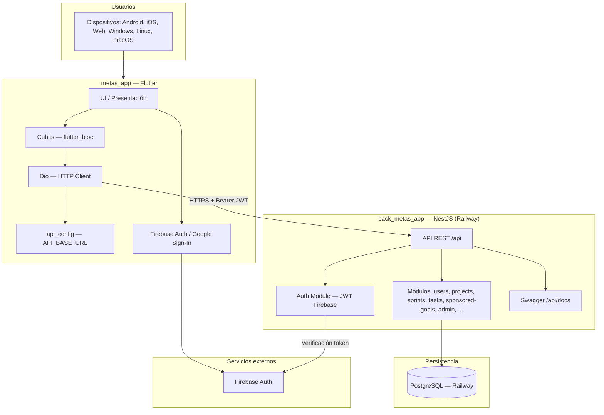

# Arquitectura del Sistema — Metas App

Documento que describe la arquitectura del sistema formado por la aplicación móvil **metas_app** (Flutter) y el backend **back_metas_app** (NestJS), desplegado en Railway con base de datos PostgreSQL.

---

## 1. Visión general

El sistema está compuesto por dos proyectos que trabajan juntos:

| Proyecto        | Descripción                                      | Ubicación                    |
|-----------------|---------------------------------------------------|------------------------------|
| **metas_app**   | Aplicación cliente (móvil multiplataforma)        | `metas_app/`                 |
| **back_metas_app** | API REST y lógica de negocio (backend)         | `back_metas_app/` (hermano)  |

- **Frontend**: app Flutter que consume la API y usa Firebase para autenticación (Google Sign-In).
- **Backend**: API NestJS con prefijo `/api`, autenticación JWT (Firebase ID token), y persistencia en PostgreSQL.
- **Despliegue**: backend y base de datos PostgreSQL en **Railway**; la URL de producción del API está configurada en el cliente (ej. `https://metasappback-production.up.railway.app`).

---

## 2. Diagrama de componentes

```
┌─────────────────────────────────────────────────────────────────────────────────┐
│                              USUARIOS / DISPOSITIVOS                              │
│                    (Android, iOS, Web, Windows, Linux, macOS)                     │
└─────────────────────────────────────────────────────────────────────────────────┘
                                          │
                                          ▼
┌─────────────────────────────────────────────────────────────────────────────────┐
│                         CAPA CLIENTE — metas_app (Flutter)                       │
│  ┌─────────────┐  ┌─────────────┐  ┌─────────────┐  ┌─────────────────────────┐ │
│  │   Auth      │  │  Projects   │  │  Sponsored  │  │  Admin / Sponsor         │ │
│  │ (Firebase)  │  │  Sprints    │  │  Goals      │  │  Gestión patrocinadores  │ │
│  │ Google Sign │  │  Tasks      │  │  Categorías │  │  Verificación hitos      │ │
│  └─────────────┘  └─────────────┘  └─────────────┘  └─────────────────────────┘ │
│  • flutter_bloc (Cubits)  • Dio (HTTP)  • api_config.dart (API_BASE_URL)          │
└─────────────────────────────────────────────────────────────────────────────────┘
                                          │
                          HTTPS (Bearer JWT — Firebase ID Token)
                                          │
                                          ▼
┌─────────────────────────────────────────────────────────────────────────────────┐
│                    CAPA SERVIDOR — back_metas_app (NestJS)                       │
│                         Desplegado en Railway                                     │
│  ┌─────────────────────────────────────────────────────────────────────────────┐ │
│  │  API REST — Prefijo global: /api                                             │ │
│  │  • /api/docs — Swagger (OpenAPI)                                             │ │
│  │  • Auth: validación JWT con Firebase Admin SDK                               │ │
│  └─────────────────────────────────────────────────────────────────────────────┘ │
│  Módulos: users, admin, projects, milestones, sprints, tasks, daily-entries,      │
│           reviews, retrospectives, sponsors, sponsored-goals, categories,         │
│           gamification, statistics, audit, auth                                  │
└─────────────────────────────────────────────────────────────────────────────────┘
                                          │
                              TypeORM (driver pg)
                                          │
                                          ▼
┌─────────────────────────────────────────────────────────────────────────────────┐
│                    BASE DE DATOS — PostgreSQL                                     │
│                         Alojada en Railway                                        │
│  • Host / puerto / usuario / contraseña / nombre DB vía variables de entorno     │
│  • Migraciones: migrations/*.ts (TypeORM)                                        │
│  • SSL en producción (rejectUnauthorized: false)                                │
└─────────────────────────────────────────────────────────────────────────────────┘

                    ┌──────────────────────────────────────┐
                    │  Firebase (externo)                  │
                    │  • Autenticación (Auth)               │
                    │  • Token ID usado como Bearer en API  │
                    │  • Backend verifica con Firebase Admin│
                    └──────────────────────────────────────┘
```

---

## 3. Diagrama de componentes (Mermaid)

Para visualizar en un visor que soporte Mermaid (GitHub, GitLab, etc.):



---

## 4. Stack tecnológico

### 4.1 Cliente — metas_app (Flutter)

| Capa / Uso      | Tecnología        | Versión / Notas                          |
|-----------------|-------------------|------------------------------------------|
| Framework       | Flutter           | SDK ^3.10.4                              |
| Lenguaje        | Dart              | 3.x                                      |
| Estado          | flutter_bloc      | ^9.1.1 (Cubits)                          |
| HTTP            | Dio               | ^5.7.0                                   |
| Autenticación   | firebase_core, firebase_auth, google_sign_in | Autenticación con Firebase y Google |
| UI              | Material / Cupertino | Cupertino Icons, temas light/dark     |
| Configuración   | api_config.dart   | API_BASE_URL (env o default)             |
| Otros           | url_launcher, flutter_native_splash |                      |

**Estructura relevante (resumen):**

- `lib/core/config/api_config.dart`: URL base del API (producción: `https://metasappback-production.up.railway.app`).
- `lib/features/`: auth, admin, projects, sponsored_goals, user, sponsor, home, etc. (domain, application, infrastructure, presentation con Cubits).

---

### 4.2 Backend — back_metas_app (NestJS)

| Capa / Uso      | Tecnología        | Versión / Notas                          |
|-----------------|-------------------|------------------------------------------|
| Framework       | NestJS            | ^11.x                                    |
| Lenguaje        | TypeScript        | ^5.7.x                                   |
| API             | Express (NestJS platform-express) | Prefijo global `/api`        |
| Documentación   | Swagger (OpenAPI) | @nestjs/swagger ^11.x — `/api/docs`      |
| ORM             | TypeORM           | ^0.3.x                                   |
| Base de datos   | PostgreSQL        | Driver `pg` ^8.x                         |
| Validación      | class-validator, class-transformer | DTOs y transformación   |
| Autenticación   | Firebase Admin SDK | Verificación del JWT (Firebase ID token) |
| Configuración   | @nestjs/config    | Variables de entorno, database.config   |

**Módulos principales:**

- **users**, **auth**: usuarios y validación JWT con Firebase.
- **admin**, **sponsors**, **sponsored-goals**: patrocinadores y metas patrocinadas.
- **projects**, **milestones**, **sprints**, **tasks**: proyectos, hitos, sprints y tareas.
- **daily-entries**, **reviews**, **retrospectives**: entradas diarias, revisiones y retrospectivas.
- **categories**, **gamification**, **statistics**, **audit**: categorías, gamificación, estadísticas y auditoría.

**Estructura por módulo (ejemplo):** domain (entities, repositories), application (use-cases, DTOs), infrastructure (persistence, mappers), presentation (controllers).

---

### 4.3 Base de datos

| Aspecto     | Tecnología / Detalle                              |
|------------|----------------------------------------------------|
| Motor      | PostgreSQL                                        |
| Acceso     | TypeORM desde NestJS (driver `pg`)                 |
| Hosteado   | Railway (servicio PostgreSQL)                      |
| Config     | DATABASE_HOST, DATABASE_PORT, DATABASE_USER, DATABASE_PASSWORD, DATABASE_NAME |
| Migraciones| TypeORM — `migrations/*.ts`, script `migration:run`|
| SSL        | Habilitado en producción (rejectUnauthorized: false) |

---

### 4.4 Despliegue e infraestructura

| Componente     | Entorno / Servicio | Notas                                      |
|----------------|--------------------|--------------------------------------------|
| Backend API    | Railway            | back_metas_app desplegado como servicio    |
| Base de datos  | Railway            | PostgreSQL como servicio en Railway        |
| URL API prod   | Railway            | Ej. `https://metasappback-production.up.railway.app` |
| Cliente        | Distribución app   | Builds Flutter (Android, iOS, Web, etc.)  |
| Autenticación  | Firebase           | Auth + Google Sign-In; token usado en API  |

---

## 5. Comunicación entre componentes

1. **Cliente → Backend**  
   - El cliente (Dio) envía peticiones HTTP/HTTPS a la URL configurada en `ApiConfig.baseUrl`.  
   - En producción apunta al backend en Railway.  
   - El header `Authorization: Bearer <firebase_id_token>` se envía en las peticiones autenticadas.

2. **Backend → Firebase**  
   - El backend usa Firebase Admin SDK para verificar el JWT recibido y obtener el `uid` (y datos necesarios) del usuario.

3. **Backend → PostgreSQL**  
   - TypeORM ejecuta las operaciones de persistencia usando las variables de entorno de base de datos; en producción la conexión es vía SSL al PostgreSQL de Railway.

4. **Flujo de despliegue backend (Railway)**  
   - Variables de entorno en Railway: `DATABASE_*`, `PORT`, `NODE_ENV`, configuración Firebase Admin (credenciales), `CORS_ORIGIN`, etc.  
   - Comando de despliegue típico: ejecutar migraciones (`migration:run`) y luego `start:prod` (según script `deploy` del backend).

---

## 6. Resumen

- **metas_app**: aplicación Flutter (Dart) con Cubits, Dio y Firebase Auth, que consume la API REST del backend.
- **back_metas_app**: API NestJS en TypeScript con TypeORM y PostgreSQL, documentada con Swagger, desplegada en Railway.
- **PostgreSQL**: base de datos alojada en Railway, accedida por el backend con SSL en producción.
- **Firebase**: autenticación (y opcionalmente otros servicios); el token de Firebase es el JWT que protege las rutas del API.

Este documento refleja la arquitectura de componentes y el stack tecnológico del sistema en su estado actual, incluyendo el despliegue del backend y de la base de datos en Railway.
